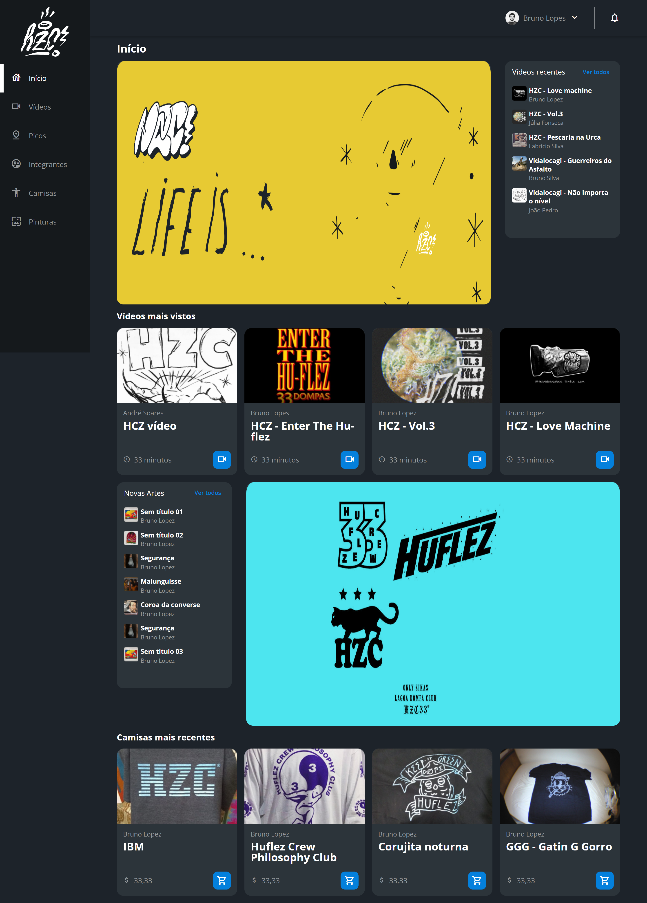

# HCZ

>Curso flexbox e grid

Projeto desenvolvido no curso da alura, no curso trabalhamos com as ferramentas flexbox, grid e vimos a questão da responsividade. A página principal foi desenvolvida durante o curso, mas fiz algumas alterações para que ficasse mais fiel ao projeto do figma e a página "Picos" foi desenvolvida por mim.

[Clique aqui para acessar](https://joaquimtoin.github.io/projeto-hcz/)

#Tecnologias

- HTML
- CSS
- Um pouquinho de Javascript